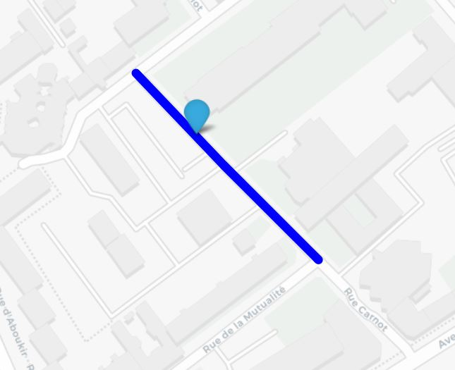

# Ebec-Paris-Saclay

Our tool is designed to meet all objectives with resilience while managing to give the user the best possible experience.

## Installation 
```bash
pip install -r requirements.txt
``` 

## Example of use 


## Technical explanations 


## Contributors 

Arnaud Petit, Simon Tronchi, Matthieu Annequin and Hicham Bouanani

## License
[MIT](https://choosealicense.com/licenses/mit/)
